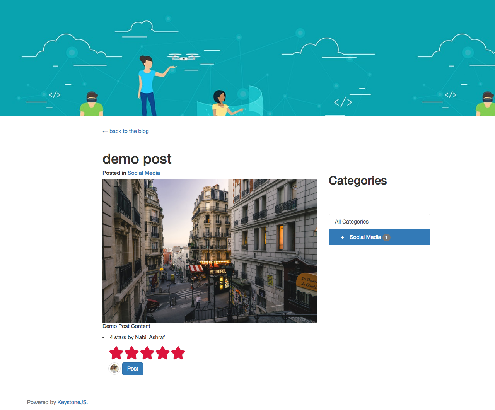
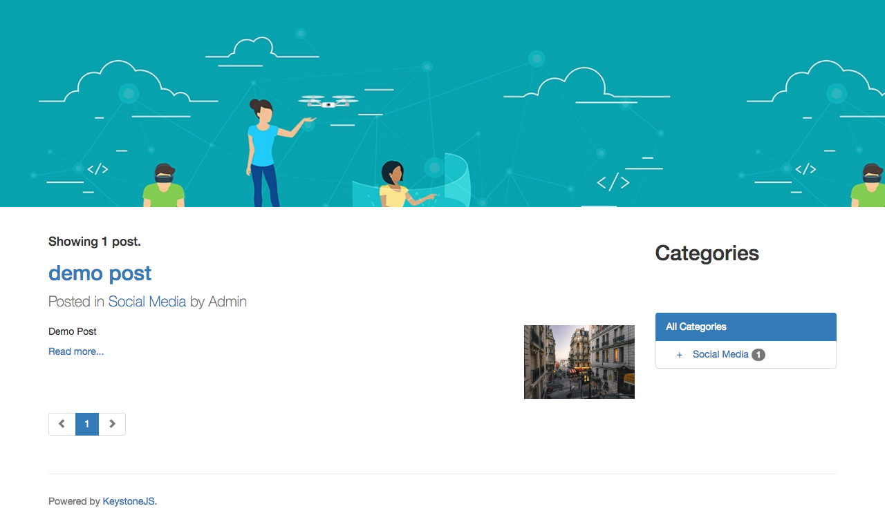

# DEMO Project

**To Start on local server**

`npm i`
`node keystone`

- To Add a Category 

  - `Go to Keystone Admin -> Post Category -> Add New`
  - `Add name`
  - `Add SubCategories after adding in the next step`

- To Add a SubCategory
  - `Go to Keystyone Admin -> Post SubCategory -> Add New`
  - `Add name and Parent Category` (only one ParentCategory logic is set)

*SubCategories in Category model is added to easily view on the front end the list of subcategories in any category*

`Blog Post Rating`

`Sub Categories in Blog`

